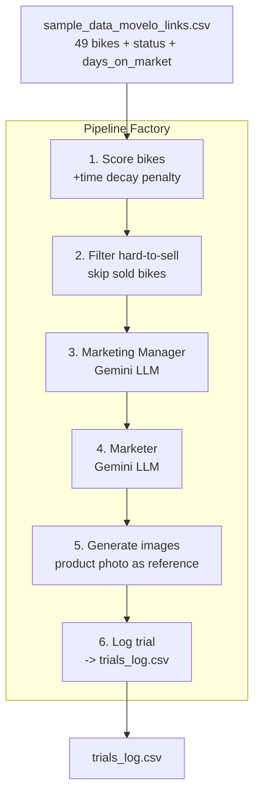

# movelo -- Refurbished Bike Marketing Pipeline (PoC)

Scores refurbished bikes by how hard they are to sell, then uses AI agents to generate marketing content for the toughest ones. Each run is a "trial" -- past attempts are logged so the agents learn from what was already tried.

## Quick start

```bash
python3.11 -m venv venv
source venv/bin/activate
pip install -r requirements.txt
echo 'GOOGLE_API_KEY=your-key-here' > .env

python main.py --test-api      # verify your API key works
python main.py                 # run one trial
python main.py --loop          # run continuously (every 300s = 1 simulated day)
python main.py --dashboard     # open the Streamlit dashboard
```

## How it works




## Configuration (.env)

All settings are controlled via `.env` (see `.env.example` for full list):


| Variable               | Default                | Description                            |
| ---------------------- | ---------------------- | -------------------------------------- |
| `GOOGLE_API_KEY`       | (required)             | Gemini API key                         |
| `LLM_MODEL`            | gemini-2.0-flash       | Model for Manager + Marketer agents    |
| `IMAGE_MODEL`          | gemini-2.5-flash-image | Model for image generation             |
| `MANAGER_TEMPERATURE`  | 0.4                    | LLM temperature for the Manager        |
| `MARKETER_TEMPERATURE` | 0.8                    | LLM temperature for the Marketer       |
| `HARD_SELL_THRESHOLD`  | 5                      | Min difficulty score to target a bike  |
| `SCORE_DECAY_PER_DAY`  | 0.15                   | Score penalty per simulated day unsold |
| `LOOP_INTERVAL_SEC`    | 300                    | Seconds between scheduler iterations   |


## Scheduler mode (`--loop`)

When run with `--loop`, the pipeline repeats every `LOOP_INTERVAL_SEC` seconds. Each tick:

1. Increments `days_on_market` for all available (not sold) bikes
2. Re-scores bikes -- scores get **worse** over time via `SCORE_DECAY_PER_DAY`
3. Runs the full pipeline (manager -> marketer -> images -> log)
4. Sleeps until the next tick

Mark a bike as **SOLD** in the Streamlit dashboard to stop it from being targeted.

## Data model

Two CSV files with an SQL-like join on `bike_id = id`:

- `**sample_data_movelo_links.csv`** -- bike inventory with `status` and `days_on_market`
- `**trials_log.csv**` -- one row per bike per trial

## Streamlit Dashboard

```bash
python main.py --dashboard
```

Four pages:

1. **Bike Inventory** -- all bikes, danger scores, "Mark as SOLD" button
2. **Trial History** -- per-trial breakdown, cross-trial comparison
3. **Image Gallery** -- original product photo vs. generated images
4. **Analytics** -- bikes x trials joined view, marketing frequency, danger alerts

## Files


| File                | What it does                                                  |
| ------------------- | ------------------------------------------------------------- |
| `main.py`           | Entry point -- CLI with `--test-api`, `--loop`, `--dashboard` |
| `config.py`         | Central config -- reads all tunables from `.env`              |
| `pipeline.py`       | Pipeline factory -- register/run ordered steps                |
| `scoring.py`        | Scoring + decay + sold status + trial log I/O                 |
| `agents.py`         | Marketing Manager + Marketer + image gen + API tests          |
| `dashboard.py`      | Streamlit dashboard (4 pages)                                 |
| `migrate_trials.py` | One-time migration from output/ to trials_log.csv             |
| `.env.example`      | Template for all config variables                             |


## Scoring formula


| Factor     | Weight    | 0 (easy)  | 5 (hard)        |
| ---------- | --------- | --------- | --------------- |
| Price      | 30%       | Cheapest  | Most expensive  |
| Mileage    | 30%       | 0 km      | 15,000+ km      |
| Condition  | 20%       | Excellent | Good            |
| Age        | 20%       | 2024      | 2021 or unknown |
| Time decay | +0.15/day | Day 0     | Accumulates     |


