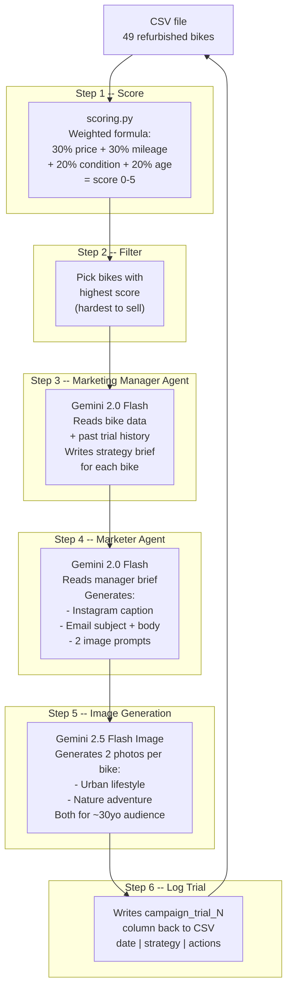
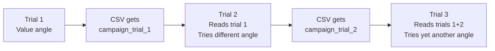

# movelo -- Refurbished Bike Marketing Pipeline (PoC)

Scores refurbished bikes by how hard they are to sell, then uses AI agents to generate marketing content for the toughest ones. Each run is a "trial" -- past attempts are logged so the agents learn from what was already tried.

## How it works



## Trial feedback loop

Each time you run `python main.py`, a new trial is created. The Marketing Manager reads all previous `campaign_trial_N` columns and avoids repeating strategies.



## Trial log format (in CSV)

Each `campaign_trial_N` cell stores a triple:

```
date | strategy used | actions taken
```

Example:

```
2026-04-09 | High-mileage high-value e-MTB at half price | instagram_post, email, 2_images
```

Only bikes that were targeted in that trial have a value -- other rows stay empty.

## Output folder structure

```
output/
  trial_1/
    bike_15_reaction_hybrid_race_750/
      content.json      # captions, email, image prompts
      urban.png         # city/lifestyle photo
      nature.png        # nature/adventure photo
    bike_17_ams_one11_c_68x_pro_29/
      ...
  trial_2/
    bike_15_reaction_hybrid_race_750/
      content.json      # different strategy this time
      urban.png
      nature.png
    ...
```

## Files

| File | What it does |
|---|---|
| `main.py` | Entry point -- runs the 6-step pipeline |
| `scoring.py` | Scores bikes 0-5, manages trial columns in CSV |
| `agents.py` | Marketing Manager + Marketer agents + image generation |
| `.env` | Your `GOOGLE_API_KEY` goes here |
| `requirements.txt` | Python dependencies |
| `sample_data_movelo_links.csv` | Bike inventory (also stores trial logs) |

## Setup and run

```bash
# Create venv (needs Python 3.11+)
python3.11 -m venv venv
source venv/bin/activate
pip install -r requirements.txt

# Add your Gemini API key
echo 'GOOGLE_API_KEY=your-key-here' > .env

# Run a trial
python main.py
```

## Scoring formula

| Factor | Weight | 0 (easy) | 5 (hard) |
|---|---|---|---|
| Price | 30% | Cheapest in dataset | Most expensive |
| Mileage | 30% | 0 km | 15,000+ km |
| Condition | 20% | Excellent | Good |
| Age | 20% | 2024 | 2021 or unknown |
