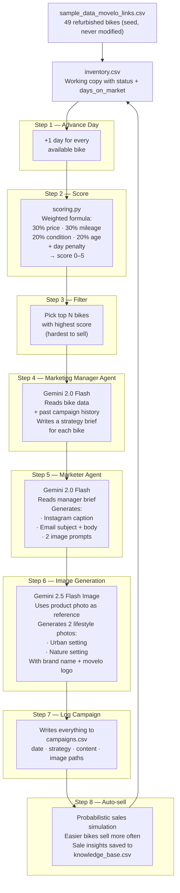

# Movelo

AI-powered marketing pipeline for a refurbished bike shop. Scores bikes by how hard they are to sell, then generates targeted campaigns (strategy briefs, Instagram copy, emails, lifestyle photos) for the toughest ones. Every campaign is logged so the AI never repeats a failed approach.

## Quick start

```bash
python3.11 -m venv venv
source venv/bin/activate
pip install -r requirements.txt
cp .env.example .env        # add your Gemini API key
python main.py --test-api   # verify API works
python main.py              # run one campaign
python main.py --dashboard  # open Streamlit dashboard
```

## Pipeline

Each run = one simulated day. The pipeline scores all bikes, picks the hardest to sell, and runs AI agents to create marketing content for them.



## Scoring

The scoring formula is a **placeholder**. It works well enough for the PoC, but the plan is to replace it with real business constraints — including a human-provided "popularity" score from the sales team.

Current formula: `score = round(base + day_penalty)`, clamped to 0–5.

- **Price** (30%) — higher price relative to inventory = harder to sell
- **Mileage** (30%) — more km = harder. Unknown km defaults to mid-range.
- **Condition** (20%) — "Good" scores worst, "Excellent" scores best
- **Age** (20%) — 2021 and older scores worst, 2024 scores best
- **Day penalty** — +0.30 per day on market, accumulates each campaign

A `popularity` weight is stubbed in `scoring.py` with weight `0.0`, ready to plug in when human scoring data is available.

## Data files

`sample_data_movelo_links.csv` is the seed — 49 bikes, never modified at runtime. On first run it gets copied to `inventory.csv`, which tracks `status` (available/sold) and `days_on_market`.

`campaigns.csv` stores one row per bike per campaign — strategy, copy, image prompts, image paths. Joined with inventory on `bike_id = id`.

`knowledge_base.csv` captures a short AI-written note every time a bike sells, explaining why it likely sold. Used to inform future campaigns.

## Dashboard

Run with `python main.py --dashboard` or `streamlit run dashboard.py`.

Five pages:

- **Bike Inventory** — all bikes with scores, filters by brand/category/score, detail view with product photo
- **Campaigns** — browse by campaign number or follow a single bike's full marketing journey
- **Run Campaign** — one button that runs the full pipeline and streams live logs
- **Analytics** — trend charts (bikes targeted, cumulative sales), danger list, brand frequency
- **Knowledge Base** — sale insights with filters, showing what worked and why

## Configuration

All settings live in `.env` (see `.env.example` for the full list). The only required one is `GOOGLE_API_KEY`.

Key tunables:
- `LLM_MODEL` / `IMAGE_MODEL` — which Gemini models to use
- `HARD_SELL_THRESHOLD` — minimum score to target a bike (default `3`)
- `AUTO_SELL_PROBABILITY` — base chance a bike sells after a campaign (default `0.40`)
- `MAX_BIKES_PER_CAMPAIGN` — cap per run to stay within LLM token limits (default `10`)
- `MANAGER_TEMPERATURE` / `MARKETER_TEMPERATURE` — agent creativity

## Project structure

```
main.py             Entry point — run one campaign, test API, or launch dashboard
config.py           Reads .env, exposes all settings
pipeline.py         Pipeline factory — register, reorder, or remove steps
scoring.py          Scoring formula, status tracking, campaign log I/O, sales sim
agents.py           LLM agents (manager, marketer, image gen, sale reason)
prompts.py          All LLM system prompts in one file for easy tuning
dashboard.py        Streamlit app (5 pages)
migrate_trials.py   One-time migration util (legacy)
```
